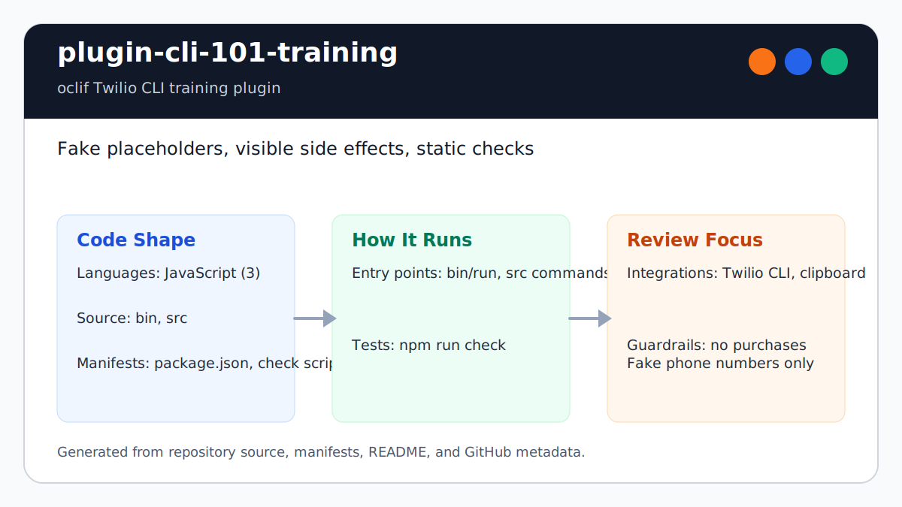

# plugin-cli-101-training

Repository maintenance and static verification require Node 22 or newer;
`.nvmrc` selects Node 24. The older oclif and Twilio CLI dependencies remain a
separate compatibility migration and should not be used to justify running an
unsupported Node release.

<!-- README-OVERVIEW-IMAGE -->


## Overview

`garethpaul/plugin-cli-101-training` is an oclif-based Twilio CLI training
plugin. It provides welcome text, feedback links, printable example commands,
and opt-in clipboard copy for CLI 101 workshops.

Examples use fake placeholder phone numbers and URLs. Review before running any
command in a live Twilio account; training examples should have no phone-number
purchases or hidden account mutations.

This README is based on the checked-in source, manifests, scripts, and repository metadata on the `main` branch. The project language mix found during review was: JavaScript (3).

## Repository Contents

- `.gitignore` - generated output, dependency, log, and environment ignores
- `CHANGES.md` - baseline change log
- `Makefile` - repository-level verification wrapper
- `README.md` - project overview and local usage notes
- `package.json` - JavaScript dependency and script metadata
- `bin` - source or example code
- `SECURITY.md` - security reporting and disclosure guidance
- `src` - source or example code
- `VISION.md` - project direction and maintenance guardrails
- `docs/plans/2026-06-08-plugin-cli-101-training-baseline.md` - completed baseline plan
- `scripts/check-baseline.js` - dependency-free static baseline checks

Additional scan context:

- Source directories: bin, src
- Dependency and build manifests: package.json
- Entry points or build surfaces: package.json, Makefile
- Test-looking files: no obvious test files detected

## Getting Started

### Prerequisites

- Git
- Node.js 22 or newer and npm; Node 24 is the repository default

### Setup

```bash
git clone https://github.com/garethpaul/plugin-cli-101-training.git
cd plugin-cli-101-training
npm install
```

The setup commands above are derived from repository files. Legacy mobile, Python, or JavaScript samples may require older SDKs or package versions than a modern workstation uses by default.

## Running or Using the Project

- Run `make check`, `make lint`, or `make build` before changing commands or
  examples.
- Use `./bin/run cli-101-training:welcome` to launch the welcome command after
  dependencies are installed.
- Use `./bin/run cli-101-training:examples --example sms` to print a specific
  example command.
- Add `--copy` only after reviewing the command and deciding to place it on the
  local clipboard.
- The frozen example catalog keeps fake placeholder training commands stable at
  runtime.
- Frozen example choices keep prompt options aligned with the reviewed catalog.
- Unknown example keys fail before any command text is printed or copied.
- The welcome command trims learner names, strips terminal control characters,
  strips bidirectional formatting controls, and caps displayed names before
  echoing them.
- Keep `bin/run` as the executable launcher for Unix installs; `bin/run.cmd`
  remains the non-executable Windows wrapper.
- Packaged launcher files stay included through the package `files` list.

Detected npm scripts:

- `npm run build` - `npm run check`
- `npm run postpack` - `rm -f oclif.manifest.json`
- `npm run prepack` - `oclif-dev manifest && oclif-dev readme`
- `npm run check` - `node scripts/check-baseline.js`
- `npm run lint` - `npm run check`
- `npm run test` - `npm run check`
- `npm run version` - `oclif-dev readme && git add README.md`

## Testing and Verification

- `make check`
- `make lint`
- `make build`
- `npm run check`
- `npm run lint`
- `npm run build`
- `npm test`
- `node scripts/check-baseline.js`
- `node test_welcome_name_format.js`
- `node test_examples_catalog.js`

When the required SDK or runtime is unavailable, use static checks and source review first, then verify on a machine that has the matching platform toolchain.

## Configuration and Secrets

- Detected references to Twilio. Keep API keys, OAuth credentials, tokens, and account-specific values in local configuration only.
- Do not commit real Twilio credentials, Account SIDs, Auth Tokens, customer
  phone numbers, messaging service IDs, webhook URLs, or workshop attendee
  data.

## Security and Privacy Notes

- Review changes touching authentication or token handling; examples from the scan include src/commands/cli-101-training/welcome.js.
- Review changes touching external API calls or credential-adjacent configuration; examples from the scan include bin/run, package.json, src/commands/cli-101-training/examples.js, src/commands/cli-101-training/feedback.js, and 1 more.
- Review changes touching network requests, sockets, or service endpoints; examples from the scan include appveyor.yml, package.json, src/commands/cli-101-training/examples.js, src/commands/cli-101-training/feedback.js.
- Review changes touching file, media, JSON, XML, CSV, OCR, or data parsing; examples from the scan include appveyor.yml, package.json, src/commands/cli-101-training/examples.js.
- Training commands can affect live accounts when copied with real credentials.
  Keep side effects visible, use fake placeholder values, and prefer read-only
  examples for phone-number workflows.
- Clipboard writes are opt-in through `--copy`; the default examples command
  prints without changing the local clipboard.
- The frozen example catalog should stay limited to reviewed fake placeholders.
- Frozen example choices should stay derived from the reviewed catalog.
- Learner names entered at the welcome prompt should stay display-only and
  sanitized before terminal output, including bidirectional formatting controls
  that could visually reorder console text.

## Maintenance Notes

- Run `npm run check`, `npm run lint`, `npm run build`, `make lint`,
  `make build`, and `make check` before changing examples, command prompts,
  package scripts, or Twilio credential handling.
- Keep the executable launcher mode on `bin/run` intact when editing packaging
  files.
- Keep packaged launcher files included when editing `package.json`.
- See `CHANGES.md` and
  `docs/plans/` for the current safe-training baseline.
- See `SECURITY.md` for vulnerability reporting and safe research guidance.
- See `VISION.md` for project direction and contribution guardrails.

## Contributing

Keep changes small and tied to the project that is already present in this repository. For code changes, document the toolchain used, avoid committing generated dependency directories or local configuration, and update this README when setup or verification steps change.
